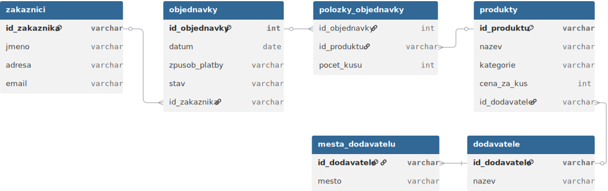
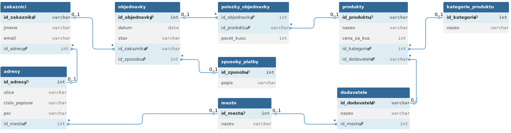

# 🛒 Návrh relační databáze pro e-shop U Majera

Tento repozitář obsahuje výukový projekt, jehož cílem je navrhnout databázový model pro fiktivní e-shop „U Majera“. Studentům je předloženo realistické zadání od zákazníka, který dosud uchovává objednávky v jediné tabulce. Úkolem je tuto tabulku postupně analyzovat a převést do plně normalizovaného databázového modelu (1NF, 2NF, 3NF) a vytvořit k němu i správný ER diagram.

---

## 📋 Obsah

- [🧾 Zadání od zákazníka – Databáze pro e-shop](#-zadání-od-zákazníka--databáze-pro-e-shop)
- [📂 Příloha: Ukázková tabulka od zákazníka](#📂-příloha-ukázková-tabulka-od-zákazníka)
- [🧠 Proč normalizujeme databázi a jak při tom postupovat](#🧠-proč-normalizujeme-databázi-a-jak-při-tom-postupovat)
- [🧩 Úkol 1 – 1NF: Odstranění neatomických hodnot](#🧩-úkol-1-úprava-tabulky-do-1-normální-formy-1nf)
- [🧩 Úkol 2 – 2NF: Odstranění částečných závislostí](#🧩-úkol-2-úprava-databáze-do-2-normální-formy-2nf)
- [🧩 Úkol 3 – 3NF: Odstranění tranzitivních závislostí](#🧩-úkol-3-úprava-databáze-do-3-normální-formy-3nf)
- [📊 Tvorba ER diagramu v dbdiagram.io](#tvorba-er-diagramu-pro-databázi-e-shopu)
- [🛠️ Problémy a řešení při normalizaci](#problémy-a-řešení-při-normalizaci-databáze)
- [📚 Další zdroje a návody](#📚-další-zdroje-a-návody)


---

# 🧾 Zadání od zákazníka – Databáze pro e-shop

> Dobrý den,
>
> jmenuji se Tomáš Majer a provozuji menší internetový obchod, ve kterém nabízím různé produkty z oblasti domácích potřeb, elektroniky a knih. Objednávky přijímám přes jednoduchý formulář a zatím všechno eviduji ručně v Excelu. Rád bych si nechal navrhnout **databázi**, která mi pomůže udržet v datech pořádek a připraví podklad pro budoucí e-shop.
>
> Zatím si ukládám všechno do jedné velké tabulky. Každý řádek odpovídá jedné položce z objednávky. Když má zákazník více položek, prostě ho zopakuji. Možná to není ideální, ale funguje mi to. Teď bych ale rád:
>
> - oddělit důležité informace (zákazníky, produkty, dodavatele atd.),
> - udržet si přehled o tom, kdo co kdy objednal a v jakém stavu je objednávka,
> - a ideálně i vidět, které produkty se nejčastěji prodávají.
>
> Zákazníci někdy objednávají znovu, ale mění adresu nebo použijí jiný telefon. Každý produkt může patřit do více žánrů (např. "sci-fi, dobrodružství") a některé produkty nakupuji od stejných dodavatelů, ale opakuji jejich název pořád dokola. Je toho už moc a ztrácím v tom přehled.
>
> ### Co si zatím eviduji:
>
> * **Objednávky:** číslo, datum, stav, způsob platby.
> * **Zákazníci:** jméno, adresa, telefon (někdy i víc čísel), e-mail.
> * **Produkty:** název, cena, kategorie, více žánrů.
> * **Dodavatelé:** název, město, někdy i webová adresa.
> * **Položky objednávky:** počet kusů z daného produktu.
>
> ---
>
> V příloze posílám ukázku své současné tabulky s deseti řádky – každý řádek je jedna položka v objednávce. Pomozte mi prosím navrhnout databázi tak, aby byla přehledná, bez zbytečných opakování a dobře se s ní pracovalo.
>
> Děkuji!
>
> **Tomáš Majer**
>
> majitel obchodu „U Majera“

### 📂 Příloha: Ukázková tabulka od zákazníka

Soubor: [objednavky_nenormalizovane.csv](csv/objednavky_nenormalizovane.csv)


---

# Návrh databáze pro e-shop – Normalizace dat

## 🧠 Proč normalizujeme databázi a jak při tom postupovat?

### Co je normalizace databáze?

Normalizace je **proces postupného zjednodušování a zpřehledňování datové struktury**. Na začátku máte často **jednu velkou tabulku**, která vypadá sice jednoduše, ale ve skutečnosti v sobě skrývá spoustu problémů:

* **opakující se údaje (redundance)**,
* **nepřesnosti (např. překlepy)**,
* **nesmyslné závislosti**,
* **zbytečné komplikace při aktualizaci nebo mazání dat**.

Cílem normalizace je:

* **rozdělit data do logických celků (tabulek)**,
* **vyloučit opakování a závislosti, které tam nepatří**,
* **usnadnit údržbu a práci s databází**.

Díky tomu je výsledná databáze:

* **přehledná**,
* **efektivní**,
* **rozšiřitelná**,
* **správně navržená** pro budoucí aplikaci nebo e-shop.

---

## 🔍 Co budeme dělat?

Dostali jste od zákazníka **reálné zadání** a jeho současný způsob ukládání dat – **jednu velkou tabulku s objednávkami**. V ní jsou informace o zákaznících, produktech, dodavatelích i jednotlivých položkách objednávek smíchané dohromady.

Vaším úkolem je:

---

### 1. krok: Analyzujte současnou tabulku

Projděte si jednotlivé řádky a hledejte:

* **opakující se údaje** (např. stejní zákazníci nebo dodavatelé),
* **více hodnot v jednom poli** (např. více telefonních čísel, více žánrů),
* **údaje, které spolu logicky nesouvisí** (např. dodavatel uložený u každé položky).

Přemýšlejte: **Které informace spolu opravdu souvisejí? Které by bylo lepší oddělit?**

---

### 2. krok: Upravte tabulku do 1. normální formy (1NF)

První normální forma znamená:

* **žádné více hodnot v jednom poli** – všechno musí být atomické (nedělitelné),
* **každý řádek reprezentuje jednu konkrétní entitu**.

Například:

* rozdělte více telefonních čísel na samostatné řádky nebo samostatnou tabulku,
* žánry rozdělte na jednotlivé položky (např. „sci-fi“ a „dobrodružství“ zvlášť).

---

### 3. krok: Najděte závislosti a rozdělte tabulku (2NF, 3NF)

* Ve 2. normální formě **odstraňujete částečné závislosti** – zjistíte, které údaje závisejí jen na části složeného klíče.

  * Např. adresa zákazníka závisí jen na zákazníkovi, ne na tom, co si koupil.

* Ve 3. normální formě **odstraňujete tranzitivní závislosti** – údaje, které se vztahují na něco jiného než přímo na klíč.

  * Např. město dodavatele závisí na dodavateli, nikoliv na produktu nebo objednávce.

---

### 4. krok: Navrhněte výsledný databázový model

Na základě normalizovaných tabulek navrhněte:

* **tabulky (entitní model)** – např. Zákazníci, Produkty, Dodavatelé, Objednávky, Položky objednávek,
* **vztahy mezi tabulkami** – kdo s čím souvisí, kdo má kolik objednávek, které produkty má na skladě apod.

Z výsledného modelu můžete vytvořit:

* **ER diagram** (Entita–Vztah),
* nebo **relační schéma** (tabulky a jejich primární/externí klíče).

---

## 💬 Shrnutí

Normalizace je **klíčový krok při návrhu databáze**. Pomáhá nám pochopit, co do databáze opravdu patří a jak ji navrhnout správně a bez chyb. Na základě příkladu firmy „U Majera“ si vše vyzkoušíte na reálných údajích.

Až databázi navrhnete správně, bude připravena pro:

* přehledné uložení dat,
* snadné vyhledávání a analýzu,
* i napojení na webovou aplikaci (např. budoucí e-shop).

---


---

# Normalizace dat – praktické úkoly

## 🧩 Úkol 1: Úprava tabulky do 1. normální formy (1NF)

### 🎯 Cíl úkolu

Vaším úkolem je **upravit datovou tabulku, kterou používá pan Majer, tak aby splňovala podmínky 1. normální formy (1NF)**. Zaměříte se na **atomizaci dat** – tedy to, aby v každé buňce tabulky byla **jen jedna jediná hodnota**.

---

### 📄 Zadání

1. Otevřete tabulku `objednavky_nenormalizovane.csv`, kterou vám zákazník poskytl.
2. Projděte všechny sloupce a najděte:

   * buňky, které obsahují **více hodnot** (oddělené čárkou, např. žánry nebo telefonní čísla),
   * **opakující se skupiny údajů**,
   * nesrovnalosti, které by mohly způsobit **chyby při zpracování**.

---

### 🔍 Co je problém z pohledu 1NF?

> **1. normální forma (1NF)** vyžaduje, aby:
>
> * každý sloupec obsahoval **jen jednu hodnotu**,
> * každá buňka byla **nedělitelná (atomická)**,
> * každý řádek představoval **jednu konkrétní entitu**.

**Příklady porušení:**

* ✅ Správně: `Žánry = fantasy`
* ❌ Špatně: `Žánry = fantasy, dobrodružství`
* ✅ Správně: `Telefonní číslo = 777123456`
* ❌ Špatně: `Telefonní číslo = 777123456, 602987654`

---

### ✍️ Úkol

1. **Najděte sloupce**, které porušují 1NF:

   * [ ] `Telefonní čísla`
   * [ ] `Žánry`
   * [ ] Jiný sloupec? _____________

2. **Navrhněte řešení:**

   * Jak byste tabulku upravili, aby každá buňka obsahovala jen jednu hodnotu?
   * Vytvoříte **novou tabulku**, nebo rozdělíte řádky?

3. **Vytvořte upravenou verzi tabulky v 1NF.**

   * Můžete buď:

     * a) **rozdělit více hodnot do samostatných řádků**, nebo
     * b) **vytvořit pomocné tabulky** (např. Zákazník–Telefon, Produkt–Žánr).

---
### Příklady řešení:

* Soubor: [1NF_objednavky.csv](csv/1NF_objednavky.csv)
* Soubor: [1NF_zakaznik_telefon.csv](csv/1NF_zakaznik_telefon.csv)

### 💡 Tipy

* Můžete použít Excel nebo libovolný tabulkový editor.
* Pokud si nejste jistí, **zeptejte se: Co přesně daná buňka popisuje?** Má v ní být jeden údaj?
* Uvažujte, jestli by se dané informace neměly **přesunout do samostatné tabulky**.

---

Skvěle, zde je další výuková část: **vysvětlení principu 2. normální formy (2NF)** a návrh rozdělení tabulky `objednavky_1NF.csv` do několika **logicky samostatných tabulek**, které odpovídají požadavkům 2NF.

---

## 🧩 Úkol 2: Úprava databáze do 2. normální formy (2NF)

### 🎯 Cíl úkolu

Vaším cílem je upravit tabulku, která již splňuje **1. normální formu**, tak, aby splňovala i **2. normální formu**. To znamená **odstranit částečné závislosti** – tedy takové údaje, které závisí **jen na části složeného klíče**, nikoli na celé primární entitě.

---

## 🧠 Co znamená 2NF?

> **2. normální forma (2NF)**:
> Databázová tabulka je ve 2NF, pokud:
>
> * je ve **1NF**,
> * a **všechny neklíčové atributy závisí na celé primární složce**, nikoliv jen na její části.

Jinými slovy: Pokud máme tabulku, kde primární klíč tvoří **více sloupců** (např. `číslo objednávky` + `název produktu`), pak v této tabulce **nesmí být žádné informace, které se vztahují jen k objednávce nebo jen k produktu zvlášť**.

---

## 🔍 Analýza současné tabulky

Tabulka `objednavky_1NF.csv` obsahuje:

* údaje o **objednávce** (`číslo objednávky`, `datum`, `stav`, `způsob platby`),
* údaje o **zákazníkovi** (`jméno`, `adresa`, `e-mail`),
* údaje o **produktu** (`název`, `kategorie`, `cena za kus`),
* údaje o **dodavateli** (`název`, `město`),
* údaj o **počtu kusů**.

---

### ❌ Problém:

Každý řádek je jednou **položkou objednávky** (konkrétní produkt v konkrétní objednávce). Pokud ale například **e-mail zákazníka** nebo **cena produktu** zůstávají stejné i v jiných objednávkách, znamená to, že tyto údaje **nezávisí na celé kombinaci objednávka–produkt**, ale jen na jedné její části.

---

## ✅ Řešení ve 2NF: Rozdělení na více logických tabulek

Z původní tabulky získáme tyto nové tabulky:

### 1. `Zakaznici`

| ID_zakaznika | Jméno        | Adresa  | E-mail                                              |
| ------------ | ------------ | ------- | --------------------------------------------------- |
| Z1           | Jan Novák    | Praha 1 | [novak.jan@email.cz](mailto:novak.jan@email.cz)     |
| Z2           | Petr Svoboda | Brno    | [svoboda.p@email.cz](mailto:svoboda.p@email.cz)     |
| Z3           | Eva Králová  | Plzeň   | [eva.kralova@email.cz](mailto:eva.kralova@email.cz) |
| …            | …            | …       | …                                                   |

---

### 2. `Objednavky`

| ID_objednavky | Datum     | Způsob platby | Stav     | ID_zakaznika |
| ------------- | --------- | ------------- | -------- | ------------ |
| 1001          | 1.12.2024 | kartou        | vyřízena | Z1           |
| 1002          | 2.12.2024 | dobírka       | vyřízena | Z2           |
| …             | …         | …             | …        | …            |

---

### 3. `Produkty`

| ID_produktu | Název produktu   | Kategorie produktu | Cena za kus |
| ----------- | ---------------- | ------------------ | ----------- |
| P1          | Hrnky sada 6ks   | Kuchyň             | 150         |
| P2          | Mixér Turbo 3000 | Elektro            | 1200        |
| …           | …                | …                  | …           |

---

### 4. `Dodavatele`

| ID_dodavatele | Název dodavatele | Město dodavatele |
| ------------- | ---------------- | ---------------- |
| D1            | Porcelán s.r.o.  | Karlovy Vary     |
| D2            | Elektro CZ       | Ostrava          |
| …             | …                | …                |

Produkty budou odkazovat na dodavatele – např. pomocí `ID_dodavatele`.

---

### 5. `Polozky_objednavky`

| ID_objednavky | ID_produktu | Počet kusů |
| ------------- | ----------- | ---------- |
| 1001          | P1          | 2          |
| 1001          | P2          | 1          |
| …             | …           | …          |

---

### ✍️ Úkol pro studenty:

1. **Určete primární klíč** v původní tabulce (pravděpodobně kombinace `Číslo objednávky + Název produktu`).
2. **Zamyslete se, které údaje závisí pouze na části tohoto klíče.**
3. **Navrhněte rozdělení tabulky do několika menších, logických tabulek.**
4. **Vytvořte nový návrh databáze ve 2NF** – formou textu, schématu nebo datové tabulky.

---
### Příklady řešení:

* Soubor: [2NF_objednavky.csv](csv/2NF_objednavky.csv)
* Soubor: [2NF_polozky_objednavky.csv](csv/2NF_polozky_objednavky.csv)
* Soubor: [2NF_produkty.csv](csv/2NF_produkty.csv)
* Soubor: [2NF_zakaznici.csv](csv/2NF_zakaznici.csv)
* Soubor: [2NF_dodavatele.csv](csv/2NF_dodavatele.csv)

---

## 🧩 Úkol 3: Úprava databáze do 3. normální formy (3NF)

### 🎯 Cíl úkolu

Vaším úkolem je upravit databázi ve **2. normální formě (2NF)** tak, aby splňovala také požadavky **3. normální formy (3NF)**. Tentokrát se zaměříme na **tzv. tranzitivní závislosti** – tedy situace, kdy je určitý údaj závislý na jiném údaji, který sám závisí na klíči.

---

### 🧠 Co znamená 3NF?

> **3. normální forma (3NF):**
> Tabulka je ve 3NF, pokud:
>
> * je ve **2NF**
> * a **neobsahuje žádné tranzitivní závislosti**, tedy:
>
>   * žádný **neklíčový atribut nesmí záviset na jiném neklíčovém atributu**.

Jinými slovy: všechny údaje by měly **záviset přímo na primárním klíči**, a **ne přes další atribut**.

---

### ❌ Příklad problému ve 2NF:

V tabulce `Produkty` máme údaj o dodavateli (`ID_dodavatele`) a v tabulce `Dodavatelé` máme také **město dodavatele**.

Jenže:

* **Město dodavatele závisí na dodavateli**, ne na produktu.
* Pokud máme stejného dodavatele u více produktů, **je město opakováno vícekrát**.

Tato **tranzitivní závislost** je zbytečná a může vést k chybám (např. překlep v názvu města jen u některého produktu).

---

### ✅ Řešení ve 3NF

Rozdělíme údaje takto:

---

### 1. `Dodavatele` (bez města):

| ID_dodavatele | Název dodavatele |
| ------------- | ---------------- |
| D1            | Porcelán s.r.o.  |
| D2            | Elektro CZ       |
| …             | …                |

---

### 2. `Mesta_dodavatelu` (vazba mezi dodavatelem a městem):

| ID_dodavatele | Město dodavatele |
| ------------- | ---------------- |
| D1            | Karlovy Vary     |
| D2            | Ostrava          |
| …             | …                |

---

Tímto krokem jsme oddělili informaci o **městu** do samostatné tabulky, kde bude vždy uvedeno **jen jednou** pro každý konkrétního dodavatele. To je přesně princip 3NF.

---

### Příklady řešení:

* Soubor: [3NF_mesta.csv](csv/3NF_mesta.csv)
* Soubor: [3NF_dodavatele.csv](csv/3NF_dodavatele.csv)

### Řešení úkolů v Excelu
* Soubor: [majer-eshop.xlsx](csv/majer-eshop.xlsx)

---

# Tvorba ER diagramu pro databázi e-shopu

## 🧾 Co je ER diagram?
ER diagram (Entity-Relationship Diagram) je **grafické znázornění struktury databáze**. Pomáhá vizualizovat:
* **entitní model** – jaké tabulky (entity) databáze obsahuje,
* **vztahy mezi tabulkami** – jak spolu jednotlivé entity souvisejí,
* **atributy entit** – jaké konkrétní údaje (sloupce) každá tabulka obsahuje.

ER diagramy jsou užitečné pro:
* plánování a návrh databáze,
* komunikaci mezi vývojáři a zadavateli,
* dokumentaci databázové struktury.

---

## ✅ Doporučený online nástroj pro tvorbu ER diagramu studenty

Níže doporučuji konkrétní **bezplatný online nástroj**, který je ideální pro výuku a tvorbu ER diagramů podle standardní notace.

---

### 🔧 [dbdiagram.io](https://dbdiagram.io)

**Vlastnosti:**

* 🟢 Zdarma a bez nutnosti instalace.
* 🧱 Podpora zápisu pomocí jednoduchého „pseudo-kódu“ podobného SQL.
* 📤 Možnost exportu do obrázku (PNG), PDF nebo SQL.
* 🧩 Vhodné pro malé i větší databázové modely.
* 👥 Možnost sdílení diagramu (linkem).
* 🎓 Ideální pro výuku – studenti vidí strukturu a ihned vizualizaci.

---

### 💡 Ukázkový zápis pro naši databázi ve 3NF

Studenti mohou do editoru na [dbdiagram.io](https://dbdiagram.io) zapsat následující model:

```dbml
Table zakaznici {
  id_zakaznika varchar [pk]
  jmeno varchar
  adresa varchar
  email varchar
}

Table objednavky {
  id_objednavky int [pk]
  datum date
  zpusob_platby varchar
  stav varchar
  id_zakaznika varchar [ref: > zakaznici.id_zakaznika]
}

Table produkty {
  id_produktu varchar [pk]
  nazev varchar
  kategorie varchar
  cena_za_kus int
  id_dodavatele varchar [ref: > dodavatele.id_dodavatele]
}

Table dodavatele {
  id_dodavatele varchar [pk]
  nazev varchar
}

Table mesta_dodavatelu {
  id_dodavatele varchar [pk, ref: > dodavatele.id_dodavatele]
  mesto varchar
}

Table polozky_objednavky {
  id_objednavky int [ref: > objednavky.id_objednavky]
  id_produktu varchar [ref: > produkty.id_produktu]
  pocet_kusu int
  Note: "Primární klíč může být složený"
}

```

---

### 📝 Úkol pro studenty

1. Otevři [https://dbdiagram.io](https://dbdiagram.io).
2. Zvol možnost **“New Diagram”**.
3. Do levého panelu zkopíruj výše uvedený zápis.
4. Pozoruj, jak se vpravo automaticky tvoří ER diagram.
5. Změň barvy, rozložení, přejmenuj názvy tabulek podle vlastního stylu.
6. Exportuj jako obrázek nebo PDF.

---
## 📚 Další zdroje a návody
* Oficiální dokumentace dbdiagram.io: [https://dbdiagram.io/docs](https://dbdiagram.io/docs)


## Ukázkový ER diagram pro e-shop


---
## Problémy a řešení při normalizaci databáze
Tvoje námitky jsou **zcela oprávněné a výborně míří ke kořeni normalizačního přemýšlení**. Pojďme je podrobně projít – každou z těchto tří položek:

---

### 🔍 1. **`adresa` zákazníka**

* Adresa bývá často uložena jako **jeden textový řetězec** (např. „Praha 1“ nebo „U Lesa 8, 500 03 Hradec Králové“).
* Ale adresa má v praxi **vnitřní strukturu**: ulice, číslo, město, PSČ, stát…

### Důsledek:

* Tím, že ji máme jako jeden atribut, **porušujeme princip atomičnosti (1NF)** – buňka obsahuje více informací.
* Nelze pak např. jednoduše filtrovat zákazníky podle města nebo třídit podle PSČ.

### Doporučené řešení:

* Rozdělit na:

  * `ulice`, `cislo_popisne`, `mesto`, `psc`, případně `stat`
* Nebo (pokročilejší): vytvořit samostatnou tabulku `adresy` s `id_adresy`, kterou by sdíleli zákazníci i dodavatelé (pokud mají více kontaktů).

---

### 🔍 2. **`zpusob_platby`**

* Příliš obecný textový údaj typu: `"kartou"`, `"dobírka"`, `"převod"`…
* Pokud se ve více objednávkách objeví překlep, vznikne **anomalie**.
* Mohlo by se v budoucnu stát, že každá objednávka bude obsahovat **celý popis platby**, třeba i s číslem účtu nebo číslem karty (nevhodné!).

### Doporučené řešení:

* Vytvořit tabulku `zpusoby_platby`:

  ```text
  id_zpusobu  |  popis
  ------------|---------
  1           | kartou
  2           | dobírka
  3           | převodem
  ```
* A v tabulce `objednavky` mít jen `id_zpusobu`.

---

### 🔍 3. **`kategorie` produktu**

* Kategorie je typicky **opakující se hodnota** např. `"elektro"`, `"kuchyň"`, `"literatura"`…
* Pokud je zadávána jako text, vzniká:

  * riziko překlepů,
  * problém při přejmenování,
  * nemožnost snadno připojit další informace o kategorii (např. ikona, priorita, popis).

### Doporučené řešení:

* Vytvořit tabulku `kategorie_produktu`:

  ```text
  id_kategorie  |  nazev
  --------------|----------
  1             | elektro
  2             | kuchyň
  3             | literatura
  ```
* A v tabulce `produkty` mít `id_kategorie` jako cizí klíč.

---

### 🧠 Závěr pro výuku

Všechny tři případy ukazují důležitý princip:

> Pokud se nějaký údaj opakuje napříč více řádky, nebo má vnitřní strukturu, **může (a často by měl) být vyčleněn do samostatné tabulky**.

---

### 🧩 Úkol

> Identifikujte ve schématu další atributy, které by bylo vhodné vyčlenit do samostatné tabulky nebo rozdělit na více atomických částí. Vyberte minimálně dva a navrhněte:
>
> * název nové tabulky,
> * strukturu jejích atributů,
> * vazbu na původní entitu (např. produkty, objednávky, zákazníci).

---

## Upravený ER diagram pro e-shop


## SQL dump pro e-shop (MySQL verze)
[SQL dump e-shopu](exports/majer_eshop.sql)